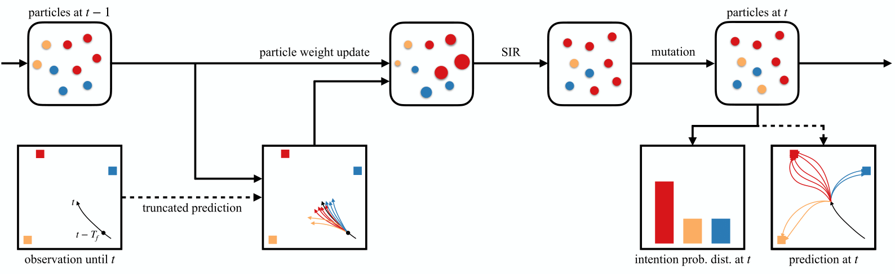

# MIF-WLSTM
This is the implementation for the paper

### Long-Term Pedestrian Trajectory Prediction Using Mutable Intention Filter and Warp LSTM

##### [Zhe Huang](https://tedhuang96.github.io/), Aamir Hasan, Kazuki Shin, Ruohua Li, [Katherine Driggs-Campbell](https://krdc.web.illinois.edu/)

published in [RA-L](https://www.ieee-ras.org/publications/ra-l/special-issues/cfp-special-long-term-human-motion-prediction).

[[Paper](https://ieeexplore.ieee.org/abstract/document/9309334?casa_token=0zMcQjvmaxIAAAAA:nBXBLhZ1X31NUuLhcHa_YD3BpjTdmwfq46oPPut-2eBYtG3t4xODJvVPgX0Hgk8dsfkQgtETHsQ)] [[arXiv](https://arxiv.org/abs/2007.00113)] [[Project](https://sites.google.com/view/mif-wlstm)]

Human behavior patterns with surrounding environments and intentions about the desired goal position provide critical information for forecasting long-term pedestrian trajectories. In this work, we introduce a Mutable Intention Filter and a Warp LSTM (MIF-WLSTM) to simultaneously estimate human intention and perform  trajectory prediction. 

<div align='center'>
  
</div>

The Mutable Intention Filter propagates particles representing the belief over intentions, and the Warp LSTM takes as input the observed trajectory and the intention hypotheses preserved in particles to output multi-modal trajectories. Thanks to the intention mutation mechanism, the intention estimation is robust against intention-changing scenarios. The probability distribution of intentions and predicted trajectories with intention hypotheses allow only the trajectories corresponding to the N most probable intentions to be the output, so as to control the multi-modality.

<div align='center'>
</img>
</div>

### Citation
If you find this repo useful, please cite
```
@article{huang2020long,
  title={Long-term Pedestrian Trajectory Prediction using Mutable Intention Filter and Warp LSTM},
  author={Huang, Zhe and Hasan, Aamir and Shin, Kazuki and Li, Ruohua and Driggs-Campbell, Katherine},
  journal={IEEE Robotics and Automation Letters},
  year={2020},
  publisher={IEEE}
}
```

### Setup
All code was developed and tested on Ubuntu 18.04 with CUDA 10.2, Python 3.6.9, and PyTorch 1.7.1. The code was also successfully tested with CUDA 11.2 and PyTorch 1.8.1. 
##### 1. Create a virtual environment. (optional)
```
virtualenv -p /usr/bin/python3 myenv
source myenv/bin/activate
```
##### 2. Install packages.
If you use CUDA 10.2, run
```
pip install scipy
pip install matplotlib
pip install tensorboardX
pip install torch==1.7.1
```
or
```
pip install -r requirements.txt
```
If you use CUDA 11.X, run
```
pip install scipy
pip install matplotlib
pip install tensorboardX
pip install torch==1.8.1+cu111 -f https://download.pytorch.org/whl/torch_stable.html
```
##### 3. Create folders and download datasets.
```
sh scripts/make_dirs.sh
sh scripts/download_datasets.sh
```
### Training & Evaluation
##### 1. Train Warp LSTM.
```
sh scripts/train_wlstm.sh
```
##### 2. Evaluate Warp LSTM.
```
sh scripts/evaluate_wlstm.sh
```
##### 3. Run experiments for Mutable Intention Filter integrated with the trained Warp LSTM, and perform evaluation on intention estimation and trajectory prediction.
```
bash scripts/run_mif.sh rebil
sh scripts/evaluate_intention_mif.sh rebil
sh scripts/evaluate_trajectories_mif.sh rebil
```
Note `rebil` is the abbreviation of Residual Bidirectional LSTM, which is the structure we apply to Warp LSTM. If we want to use the baseline `ilm`, i.e., intention-aware linear model for Mutable Intention Filter, run

```
bash scripts/run_mif.sh ilm
sh scripts/evaluate_intention_mif.sh ilm
sh scripts/evaluate_trajectories_mif.sh ilm
```
##### 4. If you want to train and evaluate more configurations, run the complete version of the scripts.
```
sh scripts/train_wlstm_complete.sh
sh scripts/evaluate_wlstm_complete.sh
bash scripts/run_mif_complete.sh
sh scripts/evaluate_intention_mif_complete.sh
sh scripts/evaluate_trajectories_mif_complete.sh
```

### Quick Test
##### 1. Evalulate pretrained models of Warp LSTM.
```
sh scripts/download_pretrained_models.sh
sh scripts/evaluate_wlstm.sh
```
##### 2. Visualization on multi-modal trajectory prediction.
```
sh scripts/download_visualization.sh
python scripts/visualize_mif_wlstm_and_sgan.py
```
##### 3. Animation on simultaneous intention filtering and multi-modal trajectory prediction.
```
sh scripts/download_animation.sh
python scripts/animate_intention_changing_case.py
```

### Contact
Please feel free to open an issue or send an email to zheh4@illinois.edu.

